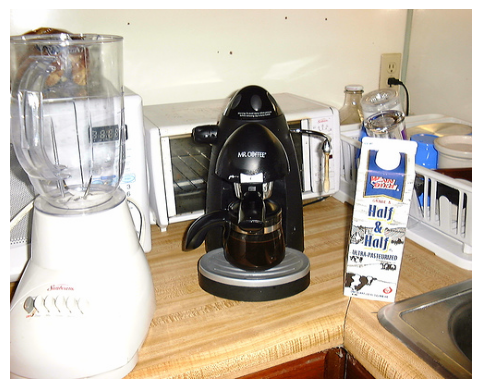

# Image-Captioning-CNN-LSTM
This repository contains an image captioning model built using a combination of Convolutional Neural Networks (CNN) and Long Short-Term Memory (LSTM) networks. The model is trained on the **COCO (Common Objects in Context)**) dataset, which consists of images paired with descriptive captions.

## 📌 Overview

Image captioning is the task of generating a textual description for an image. This project uses:

* **CNN (InceptionV3)** as a feature extractor to encode images.
* **LSTM** as a decoder to generate captions word-by-word.
* **COCO 2017 Dataset** for training and evaluation.

---

## 🧠 Model Architecture

* **Encoder (CNN)**: Pretrained InceptionV3 (or other CNN) extracts feature vectors from images.
* **Decoder (LSTM)**: Takes image features and generates captions using a recurrent neural network.
* **Embedding Layer**: GloVe embeddings are used to initialize the word embeddings.

## 🧪 Evaluation

The model's performance is evaluated using the BLEU (Bilingual Evaluation Understudy) metric, which compares generated captions with human-written references.

**BLEU Scores on COCO Validation Set:**

| Metric | Score    |
| ------ | -------- |
| BLEU-1 | 0.568926 |
| BLEU-2 | 0.382598 |
| BLEU-3 | 0.254761 |
| BLEU-4 | 0.163436 |

> 📌 *Higher BLEU-1 indicates good word-level accuracy, while BLEU-4 reflects fluency and n-gram correctness.*

## 🔍 Example Output

blender and cup of coffee on counter

hand holding remote control in their hand

group of people sitting around table with food

---